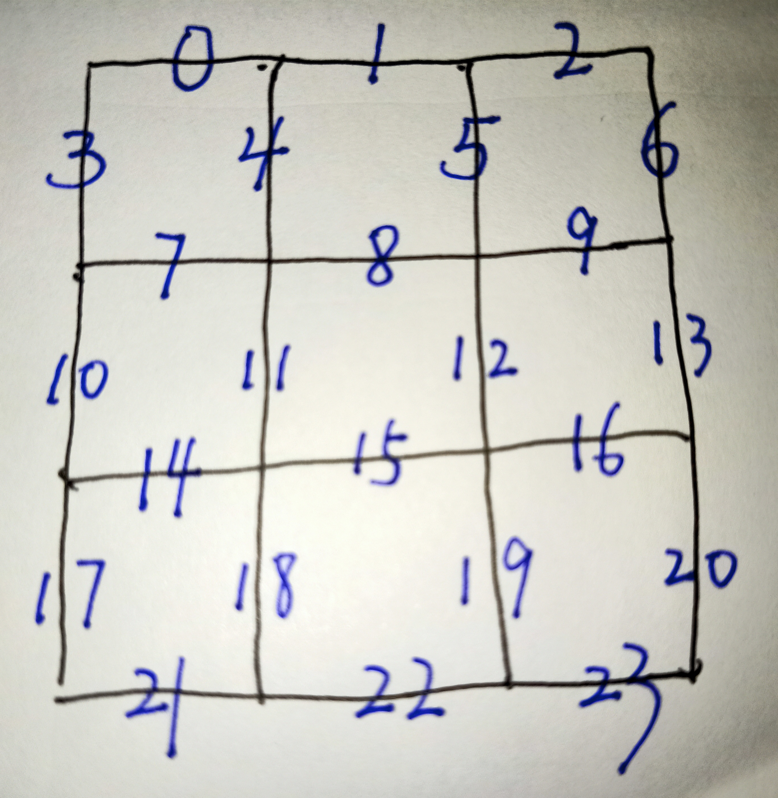
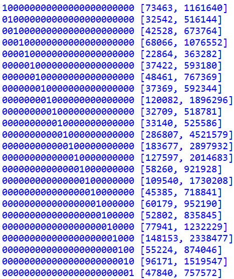

# 游戏介绍

## 基本规则



<center>游戏棋盘及下棋位置编码</center> <div align = "center">

```
（1）将操作权交给红方（也即默认红方为先手，蓝方为后手）。
（2）拥有操作权的一方，在24条短边中选一条还没有放木棍的短边，放下一根木棍：
		若放下的这根木棍与棋盘上已有的木棍（包括己方的和对方的木棍）将一个最小的方格围住（显然，棋盘上		   共有9个最小的方格），则放下这根木棍的玩家获得这个最小的方格，并跳转至（2）继续操作；
		若放下的这根木棍并未与棋盘上已有的木棍将最小的方格围住，则将操作权移交给对方，并跳转至（2）。
（3）重复（2），直至全部的24条边都已摆放木棍，此时获得小方格多的玩家获胜。
```

具体的对局样例可参考演示视频。

PS：灵感来自于小时候玩过的一个小游戏，当时使用的是5×5棋盘，本实验中将其简化为3×3棋盘。

## 关于对称下法的特殊说明

显然后手玩家存在一个对称策略：

```
（1）先手下在编码为x的位置。
（2）
若先手下完后形成了可以得分的局面（即存在一个小方格的三条边都已有木棍，这时只要再下在其剩下的那条边上就能得到这个小方格），则后手玩家选择得分的下法直至不能再继续得分：
	若（23-x）还未下，则后手下在（23-x）；
	否则，后手从此后开始一直采取随机下法。
否则，后手下（23-x）。
```

我们来做一个相关的实验，即让先手随机下，后手采用上述对称策略，进行1w局对弈，其结果为先手胜377局，后手胜9623局，可见才用对称策略能让后手获得相当大的优势。

那么先手有没有破除对称策略的方法呢？答案是肯定的，即先手一直下在最外层的边上，此时后手也会下在最外层，直至把最外层的边下满；然后先手连续两手都下在最中间的小方格的边上，显然后手也会下在最中间的小方格的边上并得到最中间的小方格，然而此时无论后手下在哪，都会让先手获得剩下的8个小方格。

在本实验中，为了更加简明地避免对称下法，我们决定加强规则，对后手的第一步棋进行限制，从一开始就打破对称局面，即若先手的第一步棋下在x的位置，则后手的第一步棋所下位置不能与x在以下的同一集合中：

{0，2，3，6，17，20，21，23}

{1，10，13，22}

{4，5，7，9，14，16，18，19}

{8，11，12，15}

# 实现方法

## 蒙特卡洛树

蒙特卡洛树中每个结点记录的是一个棋局状态，因此我们先来分析本游戏的状态空间。

首先，直观上看，本游戏一共有24个放木棍的位置，每个位置的状态确定了，整个棋局的状态就确定了。

其次，对于每个位置，看似有三种状态：红方下了这里、蓝方下了这里、这里还没下；但实际上，真正影响后续游戏决策的，只是这个位置有没有木棒，至于如果有木棒的话，这个木棒是红方下的还是蓝方下的，对后续的游戏决策并无影响。因此，对于每个位置，其实只有两种状态：有木棒或没木棒。这样，总的状态数为$2^{24}=16777216$，在本人可控的范围内。

再者，对于同一个棋局状态，可能有着不同的双方得分情况；但一旦这个棋局状态给定，棋手该怎么下就只与这个状态（即当前棋局的形状）相关，过去的得分并不会对后来的决策产生影响。

故综上所述，本游戏中的全部状态数，也即蒙特卡洛树中可能的最多结点数为$2^{24}=16777216$。

我们给每个放木棍的位置编号（如map.jpg中所示），这样就可以用一个24位的01串来唯一表示一种棋局状态。如只在0号位和23号位放有木棍，其余位置都还没放木棍的状态就表示为：100000000000000000000001.

训练过程中，当走到某个状态时，接下来的备选状态，即可通过将当前状态中的某个0改为1得到。在所有的备选状态中，我们采用置信区间上限算法来决定选择其中的哪一个，也即选取以下值最大的备选状态：
$$
v_i+C\sqrt\frac{\ln(N)}{n_i}
$$
$v_i$：第$i$选择胜率 

$C$：可调参数

$N$：所有备选选择总尝试数

$n_i$：第$i$选择尝试数

在如此下完一局后，我们将回溯棋局的所有状态，给它们的出现次数加1，并给其中属于胜利一方下出的状态的胜利次数加1，即实现了蒙特卡洛树的更新。

## 两种模型

如果让AI完全从开始进行学习，或许耗费的时间会更长，但也可能创造出人类完全无法想出的奇妙策略；

如果给AI一些先验知识，或许可以让它的水平更快得提高，但也可能使其被人类的固有算法所限制。

基于以上考虑，在本实验中，我们选择两种模型分别进行训练。

第一种模型，我们不对其施加除游戏固有规则外的任何限制，称为“无规则模型”。

第二种模型，就更“人性化”一些了。人类玩家在玩本游戏时，往往会倾向于在能得分的时候优先选择得分的下法。具体而言，如果棋盘上目前有一个格子的四条边中已经有三条边放有木棒，那么玩家会倾向于去把这个格子的第四条边也放上木棒，从而占领这个格子。这样做的直观好处看来有二：一是可以直接得分，拉开与对手的差距；而是可以获得继续放木棍的机会，抢占先机。当然，存在那样的棋局状态，即故意不得分而让对方去得分，对方在占领了一块小的地盘后，不得不送出一块更大地盘的情况，因此“有分必得”不是一个绝对占优策略。然而结合人类经验，我们可以认为有分必得在大量棋局的统计意义上还能算是比较好的策略。因此，我们的第二种模型除了遵守游戏规则和置信区间上限算法来做决策外，还要遵守“有分必得”的策略法则。这样之后，游戏的状态空间进一步缩小；至于AI的表现能否提升，我们需要之后的训练与实验来验证。

## 反思

在此处做一个关于本游戏模型本身与蒙特卡洛树的一个反思。

事实上，根据2.1中的叙述，本实验中构建的这个“蒙特卡洛树”已经不是一棵树了，而更像一个网络——这是由于两个不同的棋局状态可以在下一步变成同样的棋局状态，使得一个状态，也即“树”中的一个结点，能够拥有两个乃至多个父亲结点——据此，此时整个结构已经不是严格的树的结构了。

树与网络结构的不同会带来一些问题，例如在传统的蒙特拉洛树更新中，只要沿着棋局的路径倒着回去依次更新某个结点就行了，对于每个结点，均满足“该结点的总出现次数=该结点所有子结点总出现次数，该结点的胜利次数=该结点的所有子结点总胜利次数”。但在网络中，还要保持这种性质的话，就不仅要对出现在这次棋局中的结点进行更新，还要对这些结点的每个父结点都要更新，显得计算开销就会比较大了。

本实验中，采取的更新方式仍如前文所述，即传统的蒙特卡洛树更新方法。

# 训练过程

无规则模型：共5kw次，其中前2.5kw次c=0.6，后2.5kw次c=0.1。

规则模型：共3kw次，其中前2kw次c=0.6，后1kw次c=0.1。


前期选c=0.6的理由：让模型倾向于选择未尝试或尝试次数较少的下法，以便于尽快拓展蒙特卡洛树。

后期选c=0.1的理由：此时蒙特卡洛树拓展已基本完成，小的参数c能让模型反复强化胜率高的下法。

为了避免在前期下法太差的情况下，对后期的优秀下法产生不良评价的情况发生，我们约定在任何一方得到5分时即停止本盘棋局并开始更新蒙特卡洛树。

# 实验结果

## 结果展示

训练完成后，我和若干好友与得到的模型进行了数十盘对弈，模型表现如下：

|                | 无规则模型 |   规则模型   |
| :------------: | :--------: | :----------: |
| **模型为先手** | 人类胜率高 |  人类胜率高  |
| **模型为后手** | 人类胜率高 | 人类还没赢过 |

## 结果分析

可解释性是AI中的一个重要话题，所以我也尝试对本次的实验结果做一点解释。

无规则模型下，由于对战双方都不会积极的去得分（即在某格周围已有三根木棍时去围住该格），即使不使用特别优良的策略也可以取胜，导致出现类似于收敛于”局部最优点“的情况，让模型满足于此而不再进化。

规则模型下，我们可以打印出树中先手下第一步的相关信息如下（棋局状态 [先手胜利次数，该状态出现次数]）：



直观上可以看见，先手第一步无论下在哪里，胜率都较低（当然这也就意味着后手的概率很高）。具体计算可以得到，规则模型训练中，先手胜率为6.3%，后手胜率为93.7%。这似乎与规则模型的后手AI难以被战胜相契合。

有趣的是，我们会在一开始认为规则模型后手AI能做到如此之好，是因为先手采用了“有分得必得分”这种较为死板的策略，让后手找到了一种构造局面的方法使得自己获胜。于是我们作为人类与规则模型后手AI对弈时，会有时故意在能得分时不得分，或者故意给AI构造得分机会，也即采取与规则模型先手AI不同的下法。然而，即使我们采取了这种办法，我们依旧没能战胜规则模型后手AI——这仿佛意味着它在训练中真正学到了一种构造局面的方法来提升自己的胜率（十分有趣的是，这个AI有时会先让你得四分，再在最后一口气得到五分反败为胜），在这个特定的游戏上具备了某种智能。

# 使用说明

## 文件说明

ChessMVMWithRule.py：规则模型训练代码

ChessPVMWithRule.py：人机对战代码

Function.py：自定义函数与常量

map.jpg：下棋位置编号

tree_withrule.pkl：规则模型的蒙特卡洛树

演示视频.mp4：展示了一盘人机对战的对局，有助于快速了解本游戏的规则

由于无规则模型表现不佳且挺占地方，所以在此略去其上传。

## 开始游戏

运行"ChessPVMWithRule.py"，等待AI加载（约10-20秒，其实就是在加载保存的蒙特卡洛树）。AI加载完成后，弹出棋盘界面。其后在终端显示"轮到你时："，玩家根据map.jpg中的标记，在终端输入自己想下的位置所对应的编号并回车，即可完成一次下棋操作，并在棋盘上显示出来；AI的下棋操作会直接在棋盘上显示出来。本游戏默认玩家为先手（红方），AI为后手（蓝方）。程序会自动判断得分与胜负。

需要特别说明的是，若将"ChessPVMWithRule.py"中的第22行的learn设置为True，即可在每次对局后让蒙特卡洛树进行一次更新；由于将蒙特卡洛树写回保存文件所需时间较长（约10-20秒），且保存过程中一旦中断会导致保存的蒙特卡洛树文件损坏，因此本游戏在发布此游玩版本时默认设置learn参数为False。

直观的对局流程可参考演示视频。

